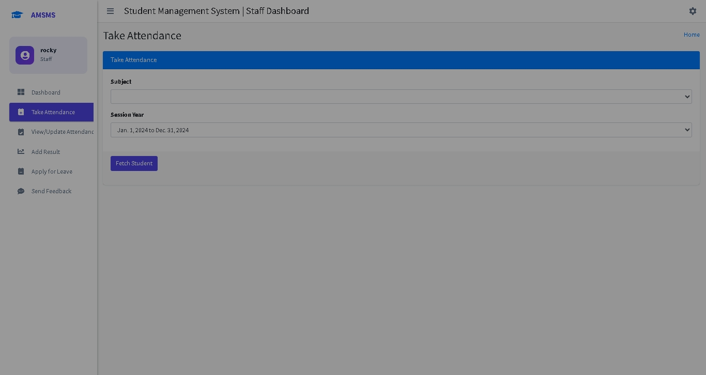
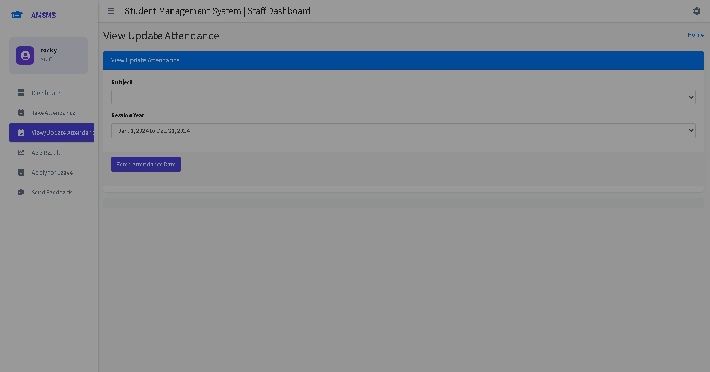

# College Management System

A Django-based College Management System that allows for managing students, staff, courses, attendance, and more.

## Setup Instructions

1. Create and activate virtual environment:
```bash
python -m venv venv
.\venv\Scripts\activate  # For Windows
source venv/bin/activate  # For Linux/Mac
```

2. Install dependencies:
```bash
pip install -r requirements.txt
```

3. Apply database migrations:
```bash
python manage.py makemigrations
python manage.py migrate
```

4. Run the development server:
```bash
python manage.py runserver
```

## Access Instructions

### Local Access
- Access the system at: http://127.0.0.1:8000

### Network Access (Multiple Devices)
To access from other devices on the network:
1. Run the server with:
```bash
python manage.py runserver 0.0.0.0:8000
```
2. Access using your computer's IP address: http://YOUR_IP:8000

## User Types and Registration

1. HOD (Head of Department):
- Register with email format: username.hod@college.com
- Example: abdul.hod@college.com

2. Staff:
- Register with email format: username.staff@college.com
- Example: john.staff@college.com

3. Student:
- Register with email format: username.student@college.com
- Example: john.student@college.com

## Features

1. HOD Features:
- Manage courses
- Manage staff
- Manage students
- View and respond to feedback
- Manage leave requests
- View attendance reports

2. Staff Features:
- Take attendance
- Manage leave requests
- Submit feedback
- Add results

3. Student Features:
- View attendance
- Submit leave requests
- Submit feedback
- View results

## Password Reset

If you forget your password:
1. Click on "Forgot Password?" on the login page
2. Enter your registered email address
3. Check your email for password reset instructions
4. Follow the link to set a new password

## Important Notes

1. The system can be accessed simultaneously from multiple browsers and devices
2. For production deployment:
   - Configure proper email settings in settings.py
   - Use a production-grade database
   - Set DEBUG=False
   - Update SECRET_KEY
   - Configure proper security settings

## Requirements

- Django==3.2.6
- django-widget-tweaks==1.4.8
- Pillow==10.2.0

## Security Considerations

1. Default email backend is set to console for development
2. Configure proper email settings for production use
3. Update ALLOWED_HOSTS in settings.py for production
4. Never expose SECRET_KEY in production

## Troubleshooting

1. If student features don't work after registration:
   - Ensure a course exists in the system
   - Ensure a session year exists
   - HOD needs to assign the student to a course

2. If you can't access from other devices:
   - Check if the server is running with 0.0.0.0:8000
   - Verify ALLOWED_HOSTS in settings.py includes your IP
   - Check network firewall settings

# Project Summary
This is a Simple College Management System Developed for Educational Purpose using Python (Django).
# Features of this Website
# A. Admin Users Can
1. See Overall Summary Charts of Students Performance, Staffs Performance, Add/Remove Courses, Add/Remove Subjects, Check/Reply Leave application of staffs/students, Check/reply on feedback bt staffs/students etc.

2. Manage Staffs (Add, Update and Delete)

3. Manage Students (Add, Update and Delete)

4. Manage Course (Add, Update and Delete)

5. Manage Subjects (Add, Update and Delete)

6. Manage Sessions (Add, Update and Delete)

7. View Student Attendance

8. Review and Reply Student/Staff Feedback

9. Review (Approve/Reject) Student/Staff Leave

10. Update Profile

11. Login/Logout

# B. Staff/Teachers Can

1. See the Overall Summary Charts related to their students, their subjects, leave status, etc.

2. Take/Update Students Attendance

3. Add/Update Result

4. Apply for Leave

5. Send Feedback to HOD

6. Update Profile

7. Login/Logout

# C. Students Can

1. See the Overall Summary Charts related to their attendance, their subjects, leave status, etc.

2. View Attendance

3. View Result

4. Apply for Leave

5. Send Feedback to HOD

6. Update Profile

7. Login/Logout

# Tech Stacks

Django, Ajax, Jquery, Bootstrap, Javascript, Python, Owl Carousel, HTML, CSS

# Project Screenshots
Home Page


User Registration


User Login


Contact Page


Admin Home Page


Staff Home Page


Student Home Page


Add Course Page


Add Student Page


Add Staff Page


Add Subject Page


Staff Take Attendance Page


Staff View and Update Attendance Page


Staff Apply for Leave


Student View Attendance Form


Student Apply for Leave


Student Send Feedback Message


Add Student Results From Staff Panel


